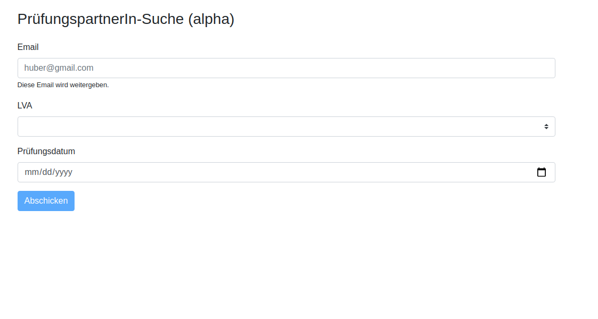

# Buddysystem 

Matches people together who want to learn for an exam together. The focus of this project lays on the University of Vienna (especially the department for law - Juridicum).

1. First, the user selects an exam, enters a date and an email
2. Then, the user will receive a confirmation mail
3. The user confirms the request by clicking the link in the email
4. The user has to wait until another user selects the same exam and date
5. Then, both users will receive an email about a match
6. After, the exam expires, the data will be deleted

